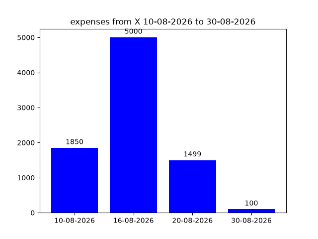

# 💰 Expense Tracker

A console-based Python application for personal finance tracking.  
Allows you to manage accounts, expense/income categories, record transactions, and generate expenditure charts for any period.

---

## 📋 Features

| # | Command | Description |
|---|---------|-------------|
| 1 | `Create Account` | Adds a new account (e.g., card, cash) |
| 2 | `Add Category` | Creates an expense or income category |
| 3 | `View Accounts` | Displays all accounts with their balances |
| 4 | `Add Transaction` | Links an amount, category, and description to a selected account |
| 5 | `All Transactions` | Shows all operations across all accounts |
| 6 | `Period Expenses` | Displays total expenses for a selected period and generates a chart |
| 7 | `Delete Account` | Deletes an account and all its associated transactions |
| `exit` | Exit | Terminates the program |

---

## 🗄️ Database (SQLite)

The project uses the built-in SQLite database.  
Below is the complete table structure with sample data from your screenshots.

### Table `accounts` (accounts)

| id | account_name | balance |
|----|--------------|---------|
| 2  | Card_2       | 1551    |

### Table `categories` (categories)

| id | name                | type     |
|----|---------------------|----------|
| 1  | product             | expense  |
| 2  | machine             | expense  |
| 3  | apartment rental    | expense  |
| 4  | cloth               | expense  |
| 5  | personal expenses   | expense  |

*All categories are of type "expense" in this example.*

### Table `transactions` (transactions)

| id | id_account | category_id | amount | description | date       |
|----|------------|-------------|--------|-------------|------------|
| 1  | 2          | 1           | 500    | None        | 10-08-2026 |
| 2  | 2          | 2           | 1350   | None        | 10-08-2026 |
| 3  | 2          | 3           | 5000   | None        | 16-08-2026 |
| 4  | 2          | 4           | 1499   | none        | 20-08-2026 |
| 5  | 2          | 2           | 100    | none        | 30-08-2026 |

**Table Relationships**

- categories.id_account → references accounts.id (category is linked to a specific account)

- transactions.account_id → references accounts.id (transaction belongs to a specific account)

- transactions.category_id → references categories.id (transaction belongs to a specific category)
---

## 📊 Period Expense Chart

When you select option **6** (`annual_exp()`), the program generates a daily expense chart.  
Example (period `10-08-2026` to `30-08-2026`):

  
*The chart shows:*
- 10.08.2026 — 1850 ₽ (500 + 1350)  
- 16.08.2026 — 5000 ₽  
- 20.08.2026 — 1500 ₽  
- 30.08.2026 — 100 ₽

---

## 🚀 Badge


## 🔧 Installation and Setup

1. Clone the repository:
```bash
git clone https://github.com/dEkuu52/expenseTracker
cd expenseTracker
```

2. Install dependencies using requirements.txt:
```bash
pip install -r requirements.txt
```

3. Run the application:
```bash
python main.py
```

## 👨‍💻 Author
> Kirill / dEkuu52 — GitHub Profile (https://github.com/dEkuu52)


---

